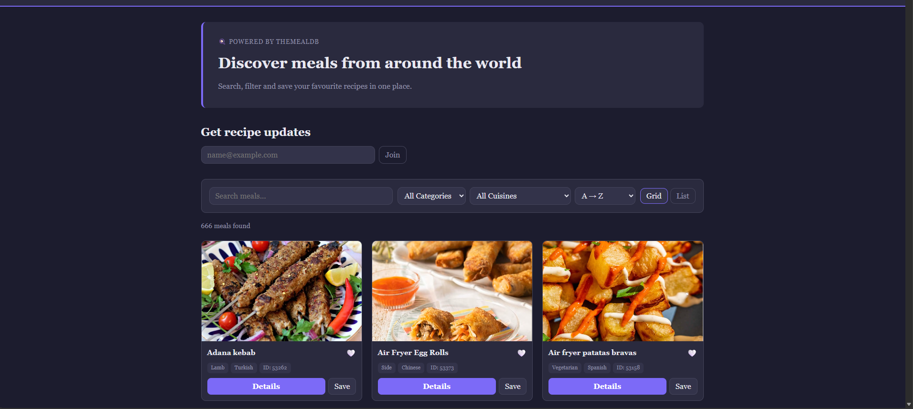
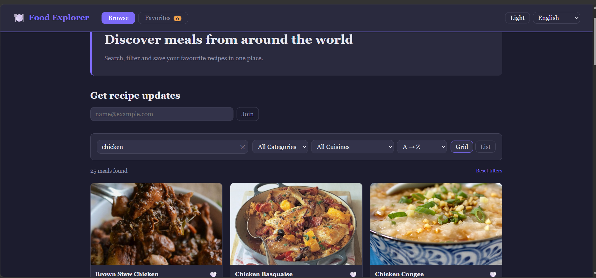
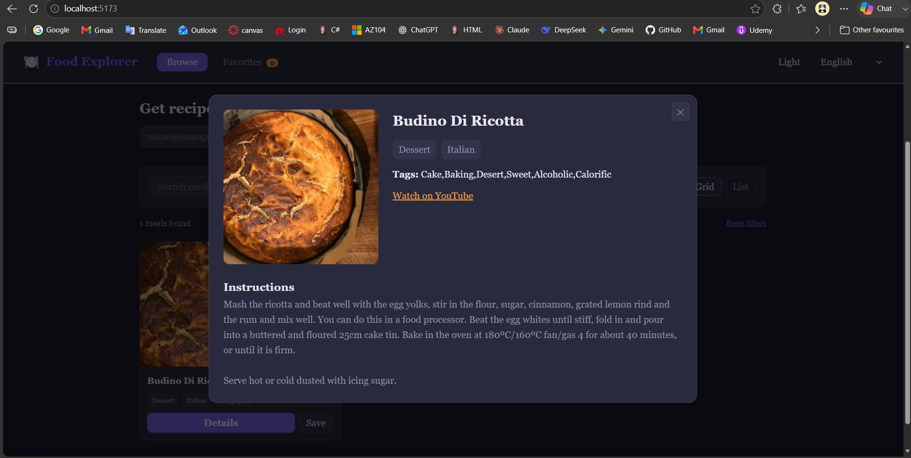
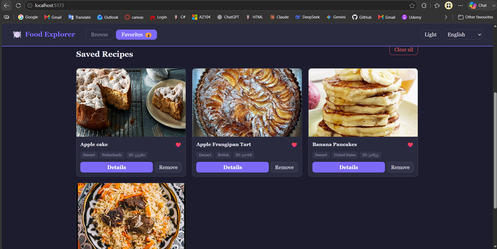
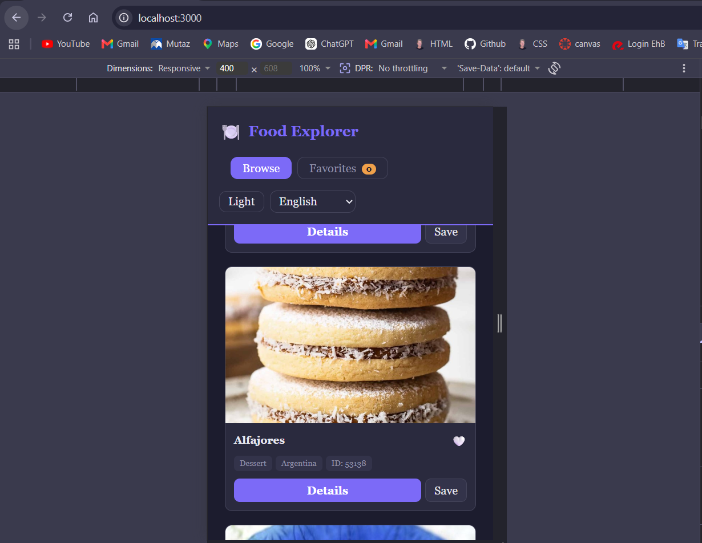

# Food Explorer

Food Explorer is a single-page web application for browsing recipes from different countries. I made it for the Web Advanced resit project. The application loads a real dataset from TheMealDB and lets the user search, filter, sort and save meals.

The interface can be used in English or Dutch. It also has a dark and light theme, a card view and a table view. The table contains seven columns, so the dataset can be compared in a more detailed way than in the card layout.

**Live demo:** add the deployed website URL here  
**Repository:** add the GitHub repository URL here

## What the application can do

- Load more than 20 meals from a public API.
- Search by meal name, category, cuisine or tag.
- Filter by category and cuisine.
- Sort by name, category or cuisine.
- Switch between a visual grid and a seven-column table.
- Open a detail window with ingredients, measures and instructions.
- Save and remove favorite meals.
- Keep favorites and user preferences between browser sessions.
- Switch between English and Dutch.
- Switch between dark and light mode.
- Validate and store an email address in the small newsletter form.
- Show useful loading, empty and error states.

## API and dataset

The project uses [TheMealDB API](https://www.themealdb.com/api.php). It is a public recipe API that returns JSON data.

For the first page, the application requests meals by their first letter and combines the results. The current version uses twelve letter endpoints. Duplicate IDs are removed, and the result is only accepted when at least 20 meals were received. The combined list is cached in `localStorage` for 24 hours, so the application does not repeat all initial requests on every visit.

The following endpoints are used:

| Purpose | Endpoint |
|---|---|
| Initial meal dataset | `search.php?f={letter}` |
| Category list | `list.php?c=list` |
| Cuisine/area list | `list.php?a=list` |
| Full details for one meal | `lookup.php?i={id}` |

A meal contains more than a name and image. The application also uses the ID, category, cuisine, tags, YouTube link, source link, instructions, ingredients and measures. This gives the dataset enough detail for filtering, table columns and the detail view.

## How to use the application

1. Open the Browse page.
2. Type in the search field to narrow the loaded dataset.
3. Combine the search with a category or cuisine filter.
4. Choose a sort option.
5. Use **Grid** for cards or **Table** for the seven-column comparison view.
6. Open **Details** to see ingredients and preparation instructions.
7. Use **Save** to add a meal to Favorites.
8. Change the language, theme or view mode. These preferences are saved automatically.

## Installation

You need Node.js and npm.

```bash
# Clone the repository
git clone <repository-url>

# Open the project folder
cd food-explorer

# Install the dependencies
npm install

# Start the development server
npm run dev
```

Vite prints the local address in the terminal, normally `http://localhost:5173`.

To create a production build:

```bash
npm run build
```

The generated files are placed in `dist/`. To check that build locally:

```bash
npm run preview
```

## Project structure

```text
food-explorer/
├── docs/
│   └── AI-usage-log.md
├── Screenshots/
│   ├── favorites.png
│   ├── home-browse.png
│   ├── meal-details.png
│   ├── mobile-view.png
│   └── search-and-filter.png
├── src/
│   ├── css/
│   │   └── main.css
│   └── js/
│       ├── api.js
│       ├── favorites.js
│       ├── filters.js
│       ├── main.js
│       ├── preferences.js
│       ├── storage.js
│       ├── translations.js
│       ├── ui.js
│       └── utils.js
├── index.html
├── package.json
├── package-lock.json
└── vite.config.js
```

`dist/` is generated by `npm run build`. It is not edited by hand.

## Technical requirements

The line numbers below refer to the final source files in this repository.

| Requirement | Where and how it is used |
|---|---|
| Select DOM elements | `src/js/ui.js`, lines 5–35: the important page elements are collected with `querySelector` and `querySelectorAll`. |
| Manipulate DOM elements | `src/js/ui.js`, lines 131–178 and 203–254: results, messages and modal content are created or updated. |
| Attach events | `src/js/main.js`, lines 312–397: input, click, change, submit and keyboard events. |
| Constants | `src/js/api.js`, lines 3–6 and `src/js/main.js`, lines 20–35. |
| Template literals | `src/js/ui.js`, lines 42–126 and 203–249: cards, table rows and modal HTML. |
| Array iteration | `src/js/api.js`, lines 80–95 and `src/js/main.js`, lines 60–69. |
| Array methods | `src/js/filters.js`, lines 1–34: `filter`, `sort` and spread syntax. Other files also use `map`, `find`, `some`, `includes` and `forEach`. |
| Arrow functions | `src/js/api.js`, lines 7 and 80; `src/js/main.js`, lines 60–69 and 172–175. |
| Ternary operator | `src/js/ui.js`, lines 39–46, 60, 73 and 92; `src/js/main.js`, lines 210–216 and 236–238. |
| Callback functions | `src/js/filters.js`, lines 36–44; event callbacks in `src/js/main.js`, lines 312–397. |
| Promises | `src/js/api.js`, lines 80–82; `src/js/favorites.js`, lines 93–113; `src/js/main.js`, lines 407–411. |
| Async and await | `src/js/api.js`, lines 10–17 and 75–130; `src/js/main.js`, lines 96–170 and 401–432. |
| Observer API | `src/js/main.js`, lines 52–70: `IntersectionObserver` adds the card animation when a card enters the viewport. |
| Fetch | `src/js/api.js`, lines 10–17. |
| JSON manipulation | `src/js/api.js`, line 17; `src/js/storage.js`, lines 4–18 use JSON parsing and stringifying. |
| Form validation | `index.html`, lines 49–58; `src/js/main.js`, lines 253–282. |
| LocalStorage | `src/js/storage.js`, lines 1–24; used by favorites, preferences, newsletter data and API cache. |
| Flexbox and CSS Grid | `src/css/main.css`, lines 105–156, 285–358, 367–448 and 609–687. |
| Basic CSS and responsive layout | `src/css/main.css`; mobile breakpoints start at lines 708, 723 and 794. |
| User-friendly controls | `index.html`, lines 17–34, 64–125 and 128–147: navigation, clear button, reset button, retry button and remove actions. |
| Seven-column list/table | `src/js/ui.js`, lines 81–126; table styling is in `src/css/main.css`, lines 450–510. |
| Vite | `package.json` and `vite.config.js`. |
| Separate folder structure | HTML is in the root, CSS is under `src/css`, JavaScript modules are under `src/js`, and the production output is generated in `dist`. |

## Technical choices

### Local search after the first load

The initial API result is kept in memory. Searching, filtering and sorting are then done locally. This avoids making a new network request for every key press and prevents older search requests from replacing newer results.

### Grid and table are rendered separately

The grid is useful for images and quick browsing. The table is generated with seven columns: image, meal, category, cuisine, tags, video status and actions. On smaller screens, the table can scroll horizontally instead of squeezing the columns until they become unreadable.

### Favorites contain a small meal snapshot

Favorites are stored with the meal ID, save date and the basic meal data. This lets the Favorites page open quickly and keeps the collection available between sessions. The code also recognizes the older version where favorites were saved as plain ID strings.

### Separate detail request

The first dataset only keeps the fields needed for browsing. Ingredients, measures and long instructions are requested when the user opens a meal. This keeps the cached dataset smaller.

### Error handling

The initial API calls use `Promise.allSettled`. A few failed letter requests do not break the entire page, but the application shows an error when fewer than 20 meals can be collected. Empty results are not saved as a valid cache.

## Screenshots

The images below were kept from the previous working version. The final code has a new table view and an expanded details window, so these images should be replaced with fresh screenshots after the project is deployed.

### Browse page



### Search and filtering



### Meal details



### Favorites



### Mobile layout



## Known limitations

- TheMealDB can be temporarily unavailable or slow because it is an external service.
- The newsletter form is a front-end demonstration. It stores the address locally and does not send real emails.
- The first uncached visit makes several API requests to build a dataset with enough meals.
- Automated browser tests are not included yet.

## Possible improvements

- Add pagination or a “load more” button for very large datasets.
- Add filters for ingredients and tags.
- Add automated tests for filtering, storage and UI actions.
- Add a dedicated recipe comparison page.
- Add a service worker for stronger offline support.

## Sources

- [TheMealDB API documentation](https://www.themealdb.com/api.php)
- [Vite guide](https://vite.dev/guide/)
- [MDN: Fetch API](https://developer.mozilla.org/en-US/docs/Web/API/Fetch_API)
- [MDN: Web Storage API](https://developer.mozilla.org/en-US/docs/Web/API/Web_Storage_API)
- [MDN: Intersection Observer API](https://developer.mozilla.org/en-US/docs/Web/API/Intersection_Observer_API)
- [AI assistance log required by the assignment](docs/AI-usage-log.md)

---

# Nederlandse versie

## Food Explorer

Food Explorer is een single-page webapplicatie waarmee je recepten uit verschillende landen kunt ontdekken. Ik heb deze applicatie gemaakt voor het herexamen Web Advanced. De app haalt een echte dataset op via TheMealDB en laat de gebruiker zoeken, filteren, sorteren en maaltijden bewaren.

De interface werkt in het Engels en Nederlands. Er is ook een donker en licht thema, een kaartweergave en een tabelweergave. De tabel bevat zeven kolommen, zodat de gegevens duidelijker met elkaar vergeleken kunnen worden.

**Live demo:** voeg hier na de deployment de website-URL toe  
**Repository:** voeg hier de URL van de GitHub-repository toe

## Wat de applicatie kan

- Meer dan 20 maaltijden ophalen via een publieke API.
- Zoeken op naam, categorie, keuken of tag.
- Filteren op categorie en keuken.
- Sorteren op naam, categorie of keuken.
- Wisselen tussen een visueel raster en een tabel met zeven kolommen.
- Een detailvenster openen met ingrediënten, hoeveelheden en bereidingswijze.
- Favoriete maaltijden opslaan en verwijderen.
- Favorieten en voorkeuren tussen browsersessies bewaren.
- Wisselen tussen Engels en Nederlands.
- Wisselen tussen een donker en licht thema.
- Een e-mailadres controleren en lokaal opslaan via het nieuwsbrief formulier.
- Duidelijke laad-, lege- en foutmeldingen tonen.

## API en dataset

Het project gebruikt de [TheMealDB API](https://www.themealdb.com/api.php). Dit is een publieke recepten-API die gegevens als JSON terugstuurt.

Voor de startpagina vraagt de applicatie maaltijden op volgens hun eerste letter en voegt ze de resultaten samen. De huidige versie gebruikt twaalf letter-endpoints. Dubbele ID's worden verwijderd en het resultaat wordt alleen aanvaard wanneer minstens 20 maaltijden ontvangen werden. De samengestelde lijst wordt 24 uur in `localStorage` gecachet, zodat de applicatie niet bij elk bezoek alle startrequests opnieuw uitvoert.

De volgende endpoints worden gebruikt:

| Doel | Endpoint |
|---|---|
| Eerste dataset met maaltijden | `search.php?f={letter}` |
| Lijst van categorieën | `list.php?c=list` |
| Lijst van keukens/landen | `list.php?a=list` |
| Volledige details van één maaltijd | `lookup.php?i={id}` |

Een maaltijd bevat meer dan alleen een naam en afbeelding. De applicatie gebruikt ook het ID, de categorie, keuken, tags, YouTube-link, bronlink, instructies, ingrediënten en hoeveelheden. Daardoor is de dataset uitgebreid genoeg voor de filters, tabelkolommen en detailweergave.

## De applicatie gebruiken

1. Open de pagina Ontdekken.
2. Typ in het zoekveld om de geladen dataset te verkleinen.
3. Combineer de zoekterm met een categorie- of keukenfilter.
4. Kies een sorteermethode.
5. Gebruik **Raster** voor kaarten of **Tabel** voor de vergelijking met zeven kolommen.
6. Open **Details** om de ingrediënten en bereidingswijze te bekijken.
7. Gebruik **Opslaan** om een maaltijd aan Favorieten toe te voegen.
8. Verander de taal, het thema of de weergave. Deze voorkeuren worden automatisch bewaard.

## Installatie

Node.js en npm zijn nodig.

```bash
# Clone de repository
git clone <repository-url>

# Open de projectmap
cd food-explorer

# Installeer de dependencies
npm install

# Start de development server
npm run dev
```

Vite toont het lokale adres in de terminal, normaal gezien `http://localhost:5173`.

Een productiebuild maken:

```bash
npm run build
```

De gegenereerde bestanden komen in `dist/`. Die build lokaal controleren:

```bash
npm run preview
```

## Projectstructuur

```text
food-explorer/
├── docs/
│   └── AI-usage-log.md
├── Screenshots/
│   ├── favorites.png
│   ├── home-browse.png
│   ├── meal-details.png
│   ├── mobile-view.png
│   └── search-and-filter.png
├── src/
│   ├── css/
│   │   └── main.css
│   └── js/
│       ├── api.js
│       ├── favorites.js
│       ├── filters.js
│       ├── main.js
│       ├── preferences.js
│       ├── storage.js
│       ├── translations.js
│       ├── ui.js
│       └── utils.js
├── index.html
├── package.json
├── package-lock.json
└── vite.config.js
```

`dist/` wordt aangemaakt door `npm run build` en wordt niet handmatig aangepast.

## Technische vereisten

De onderstaande regelnummers verwijzen naar de definitieve bronbestanden in deze repository.

| Vereiste | Waar en hoe toegepast |
|---|---|
| DOM-elementen selecteren | `src/js/ui.js`, regels 5–35: de belangrijkste pagina-elementen worden verzameld met `querySelector` en `querySelectorAll`. |
| DOM-elementen aanpassen | `src/js/ui.js`, regels 131–178 en 203–254: resultaten, meldingen en modalinhoud worden opgebouwd of aangepast. |
| Events koppelen | `src/js/main.js`, regels 312–397: input-, click-, change-, submit- en keyboardevents. |
| Constanten | `src/js/api.js`, regels 3–6 en `src/js/main.js`, regels 20–35. |
| Template literals | `src/js/ui.js`, regels 42–126 en 203–249: kaarten, tabelrijen en modal-HTML. |
| Iteratie over arrays | `src/js/api.js`, regels 80–95 en `src/js/main.js`, regels 60–69. |
| Array methods | `src/js/filters.js`, regels 1–34: `filter`, `sort` en spread syntax. Andere bestanden gebruiken ook `map`, `find`, `some`, `includes` en `forEach`. |
| Arrow functions | `src/js/api.js`, regels 7 en 80; `src/js/main.js`, regels 60–69 en 172–175. |
| Ternary operator | `src/js/ui.js`, regels 39–46, 60, 73 en 92; `src/js/main.js`, regels 210–216 en 236–238. |
| Callback functions | `src/js/filters.js`, regels 36–44; eventcallbacks in `src/js/main.js`, regels 312–397. |
| Promises | `src/js/api.js`, regels 80–82; `src/js/favorites.js`, regels 93–113; `src/js/main.js`, regels 407–411. |
| Async en await | `src/js/api.js`, regels 10–17 en 75–130; `src/js/main.js`, regels 96–170 en 401–432. |
| Observer API | `src/js/main.js`, regels 52–70: `IntersectionObserver` voegt de kaartanimatie toe wanneer een kaart zichtbaar wordt. |
| Fetch | `src/js/api.js`, regels 10–17. |
| JSON verwerken | `src/js/api.js`, regel 17; `src/js/storage.js`, regels 4–18 gebruiken JSON parsing en stringifying. |
| Formuliervalidatie | `index.html`, regels 49–58; `src/js/main.js`, regels 253–282. |
| LocalStorage | `src/js/storage.js`, regels 1–24; gebruikt voor favorieten, voorkeuren, nieuwsbriefgegevens en API-cache. |
| Flexbox en CSS Grid | `src/css/main.css`, regels 105–156, 285–358, 367–448 en 609–687. |
| Basis-CSS en responsive layout | `src/css/main.css`; de mobiele breakpoints starten op regels 708, 723 en 794. |
| Gebruiksvriendelijke bediening | `index.html`, regels 17–34, 64–125 en 128–147: navigatie, wisknop, resetknop, retryknop en verwijderacties. |
| Tabel met zeven kolommen | `src/js/ui.js`, regels 81–126; tabelstyling staat in `src/css/main.css`, regels 450–510. |
| Vite | `package.json` en `vite.config.js`. |
| Gescheiden folderstructuur | HTML staat in de root, CSS onder `src/css`, JavaScriptmodules onder `src/js` en de productie-output wordt in `dist` gegenereerd. |

## Technische keuzes

### Lokaal zoeken na de eerste laadbeurt

De eerste API-resultaten blijven in het geheugen. Zoeken, filteren en sorteren gebeuren daarna lokaal. Daardoor is er niet bij elke toetsaanslag een nieuw netwerkrequest nodig en kunnen oude zoekrequests geen nieuwere resultaten overschrijven.

### Raster en tabel worden apart opgebouwd

Het raster is handig voor afbeeldingen en snel browsen. De tabel wordt opgebouwd met zeven kolommen: afbeelding, maaltijd, categorie, keuken, tags, videostatus en acties. Op kleinere schermen kan de tabel horizontaal scrollen, zodat de kolommen leesbaar blijven.

### Favorieten bevatten een kleine kopie van de maaltijdgegevens

Bij een favoriet worden het maaltijd-ID, de datum en de basisgegevens opgeslagen. Daardoor opent de pagina Favorieten sneller en blijft de collectie tussen sessies beschikbaar. De code herkent ook de oudere versie waarin favorieten alleen als losse ID-strings opgeslagen werden.

### Apart request voor details

De eerste dataset bewaart alleen de velden die nodig zijn om te browsen. Ingrediënten, hoeveelheden en lange instructies worden opgehaald wanneer de gebruiker een maaltijd opent. Zo blijft de gecachete dataset kleiner.

### Foutafhandeling

De eerste API-calls gebruiken `Promise.allSettled`. Enkele mislukte letterrequests breken de volledige pagina niet, maar de applicatie toont wel een fout wanneer minder dan 20 maaltijden verzameld kunnen worden. Een leeg resultaat wordt niet als geldige cache opgeslagen.

## Screenshots

De onderstaande afbeeldingen komen uit de vorige werkende versie. De definitieve code heeft een nieuwe tabelweergave en een uitgebreid detailvenster. Vervang deze afbeeldingen daarom door nieuwe screenshots nadat het project gedeployed is.

### Ontdekpagina


### Zoeken en filteren


### Details van een maaltijd


### Favorieten


### Mobiele layout


## Gekende beperkingen

- TheMealDB kan tijdelijk traag of niet beschikbaar zijn omdat het een externe dienst is.
- Het nieuwsbrief formulier is een front-end demonstratie. Het adres wordt lokaal opgeslagen en er worden geen echte mails verstuurd.
- Bij het eerste bezoek zonder cache zijn meerdere API-requests nodig om een voldoende grote dataset op te bouwen.
- Er zijn nog geen automatische browsertests opgenomen.

## Mogelijke uitbreidingen

- Paginatie of een knop “meer laden” toevoegen voor zeer grote datasets.
- Filters voor ingrediënten en tags toevoegen.
- Automatische tests toevoegen voor filtering, opslag en UI-acties.
- Een aparte pagina maken om recepten te vergelijken.
- Een service worker toevoegen voor betere offline ondersteuning.

## Bronnen

- [TheMealDB API-documentatie](https://www.themealdb.com/api.php)
- [Vite-handleiding](https://vite.dev/guide/)
- [MDN: Fetch API](https://developer.mozilla.org/en-US/docs/Web/API/Fetch_API)
- [MDN: Web Storage API](https://developer.mozilla.org/en-US/docs/Web/API/Web_Storage_API)
- [MDN: Intersection Observer API](https://developer.mozilla.org/en-US/docs/Web/API/Intersection_Observer_API)
- [AI-gebruikslogboek zoals gevraagd in de opdracht](docs/AI-usage-log.md)
