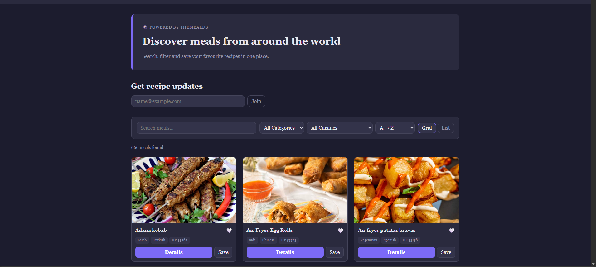
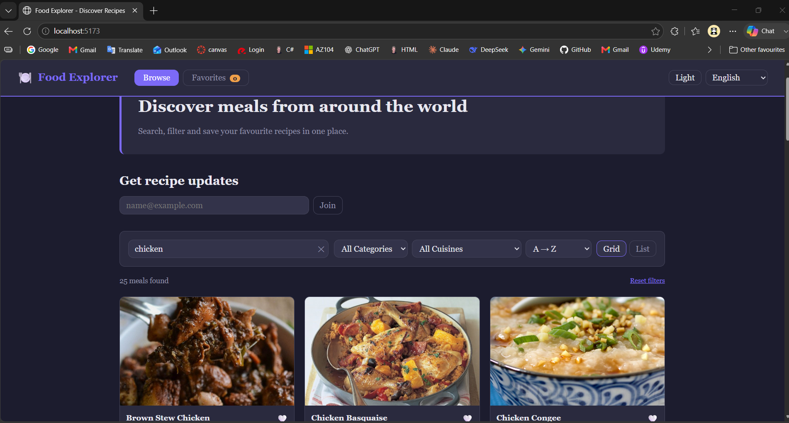
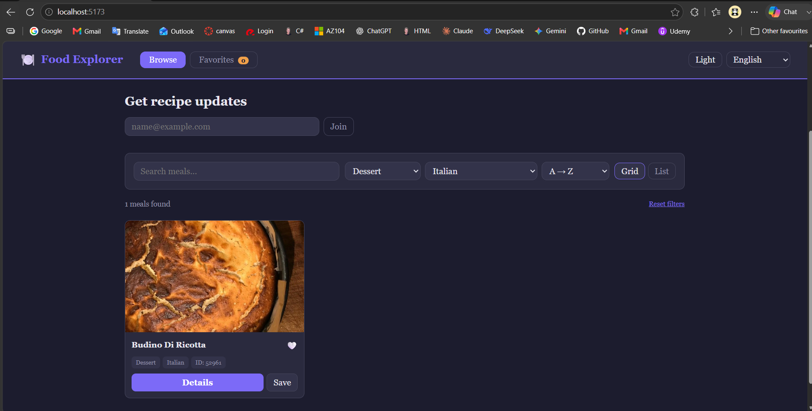
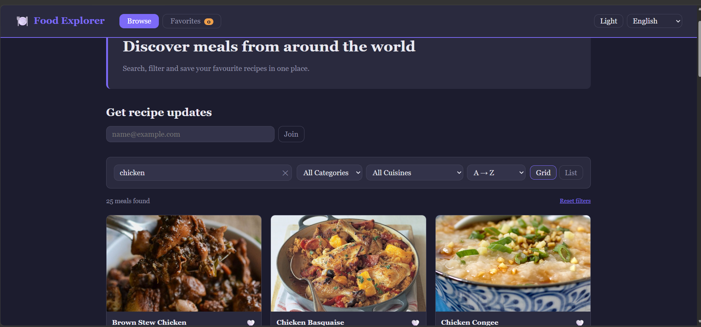
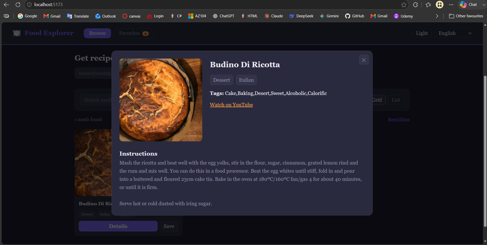
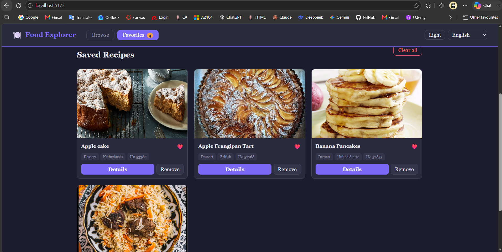
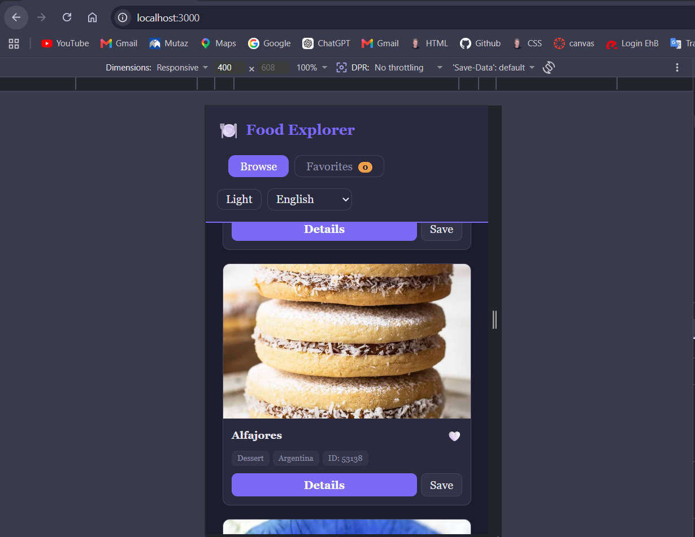

# Food Explorer

Food Explorer is a single page web application that I made for the Advanced Web course.

The website uses TheMealDB API to show meals from different countries and categories. Users can browse meals, search, filter, sort and save their favorite meals.

The project is made with HTML, CSS, JavaScript and Vite.

## Features

The website has the following functions:

* browse meals from TheMealDB
* search for meals by name, category, cuisine or tag
* filter by category
* filter by cuisine
* sort meals from A to Z and Z to A
* sort by category or cuisine
* grid and table view
* meal detail popup
* save and remove favorites
* dark and light theme
* English and Dutch language option
* responsive layout for mobile and desktop
* newsletter form with validation

Favorites and user settings are saved with LocalStorage, so they stay saved after refreshing or reopening the website.

## API

For this project I used the [TheMealDB API](https://www.themealdb.com/api.php).

The API gives information about meals such as:

* name
* image
* category
* cuisine
* tags
* ingredients
* measurements
* cooking instructions

The application loads more than 20 meals from the API.

## Screenshots

### Browse page



### Search



### Filter



### Search and filter



### Meal details



### Favorites



### Mobile view



## Installation

Clone the repository:

```bash
git clone https://github.com/Bro-Baraa/EhB.git
```

Go to the project folder:

```bash
cd "EhB/Web Advance/Web Advance - Project/Food Explorer"
```

Install the dependencies:

```bash
npm install
```

Start the development server:

```bash
npm run dev
```

Build the project:

```bash
npm run build
```

Preview the build:

```bash
npm run preview
```

## Project structure

```text
Food Explorer/
├── src/
│   ├── css/
│   │   └── main.css
│   └── js/
│       ├── api.js
│       ├── favorites.js
│       ├── filters.js
│       ├── main.js
│       ├── preferences.js
│       ├── storage.js
│       ├── translations.js
│       ├── ui.js
│       └── utils.js
├── Screenshots/
├── index.html
├── package.json
├── package-lock.json
├── vite.config.js
└── README.md
```

The JavaScript is split into different files to keep the project easier to read.

* `api.js` is used for API requests.
* `filters.js` contains the search, filter and sorting functions.
* `favorites.js` is used for favorites.
* `preferences.js` handles settings such as theme, language and view.
* `storage.js` contains the LocalStorage functions.
* `ui.js` is used to create and update elements on the page.
* `main.js` connects the different parts of the application and contains most event listeners.

## Technical requirements

This table shows where the required concepts are used in the project.

| Requirement        | File                                            | Lines                                                    | How it is used                                                                    |
| ------------------ | ----------------------------------------------- | -------------------------------------------------------- | --------------------------------------------------------------------------------- |
| DOM selection      | `ui.js`                                         | 5–34                                                     | Elements are selected with `querySelector` and `querySelectorAll`                 |
| DOM manipulation   | `ui.js`                                         | 120–187, 192–239                                         | HTML content and classes are updated with JavaScript                              |
| Events             | `main.js`                                       | 293–373                                                  | Event listeners are used for search, filters, buttons, forms and keyboard events  |
| `const`            | Multiple files                                  | multiple                                                 | Used for variables that are not reassigned                                        |
| Template literals  | `ui.js`                                         | 42–118, 194–239                                          | Used to create HTML with dynamic values                                           |
| Array iteration    | `api.js`, `favorites.js`, `filters.js`, `ui.js` | multiple                                                 | Arrays are iterated with methods such as `forEach`, `map` and `filter`            |
| Array methods      | `filters.js`                                    | 8–47                                                     | Methods such as `filter` and `sort` are used for searching, filtering and sorting |
| Arrow functions    | Multiple files                                  | multiple                                                 | Arrow functions are used for callbacks and functions                              |
| Ternary operator   | `ui.js`                                         | 42–44, 57, 132–134                                       | Used for simple conditional values and rendering                                  |
| Callback functions | `filters.js`, `main.js`                         | `filters.js` 56–58; `main.js` 296–371                    | Functions are passed as callbacks to `setTimeout` and event listeners             |
| Promises           | `api.js`, `favorites.js`, `main.js`             | `api.js` 76–77; `favorites.js` 89–108; `main.js` 382–386 | `Promise.all()`, `Promise.allSettled()` and other promises are used               |
| Async / Await      | `api.js`, `favorites.js`, `main.js`             | multiple                                                 | `async` and `await` are used for API requests and application loading             |
| Observer API       | `main.js`                                       | 50–66                                                    | `IntersectionObserver` is used to animate meal cards when they appear             |
| Fetch              | `api.js`                                        | 10–16                                                    | `fetch()` is used to request data from TheMealDB                                  |
| JSON manipulation  | `api.js`, `storage.js`                          | `api.js` 10–16; `storage.js` 5–20                        | `response.json()`, `JSON.stringify()` and `JSON.parse()` are used                 |
| Form validation    | `main.js`                                       | 239–265                                                  | The newsletter email is validated before it is saved                              |
| LocalStorage       | `storage.js`, `favorites.js`, `preferences.js`  | multiple                                                 | Used for favorites, user settings and cached API data                             |
| CSS Grid / Flexbox | `main.css`                                      | 105–140, 272–355                                         | Flexbox and CSS Grid are used for the layout                                      |
| Responsive design  | `main.css`                                      | 679–779                                                  | Media queries are used for tablet and mobile screen sizes                         |
| Vite               | `package.json`, `vite.config.js`                | all                                                      | Vite is used to run, build and preview the project                                |
| Folder structure   | Project root                                    | all                                                      | HTML, CSS and JavaScript are separated into a clear folder structure              |

## Search, filters and sorting

The search function can search meals by name, category, cuisine or tag.

The user can filter meals by:

* category
* cuisine

The sorting options are:

* A to Z
* Z to A
* category
* cuisine

The search input uses a debounce function so the results do not update too many times while the user is typing.

## Favorites

A meal can be added to favorites with the favorite button.

Favorites are stored in LocalStorage and can also be removed from the favorites page.

The number of saved favorites is shown in the navigation.

## Meal details

Clicking on a meal opens a detail window.

The detail window shows information about the selected meal such as:

* image
* name
* category
* cuisine
* ingredients
* measurements
* instructions
* tags

## Table view

The application has a table view in addition to the normal grid view.

The table contains seven columns with information about the meals.

The selected view is saved so it stays the same after refreshing the page.

## User preferences

The application saves some user preferences with LocalStorage:

* selected theme
* selected language
* grid or table view

These settings stay saved when the user opens the website again.

## API cache

Some API data is cached in LocalStorage so the same data does not always need to be loaded again.

## Responsive design

The layout works on desktop and smaller screens.

CSS Grid and Flexbox are used in `main.css`.

Media queries are used to change the layout for smaller screen sizes.


## AI Usage

AI was used during the project to help me understand the assignment requirements, solve some coding problems, debug errors, and improve parts of the README.
I reviewed the code and tested the application myself.


## Sources

* [TheMealDB API](https://www.themealdb.com/api.php)
* [MDN Web Docs](https://developer.mozilla.org/)
* [Vite](https://vite.dev/)
